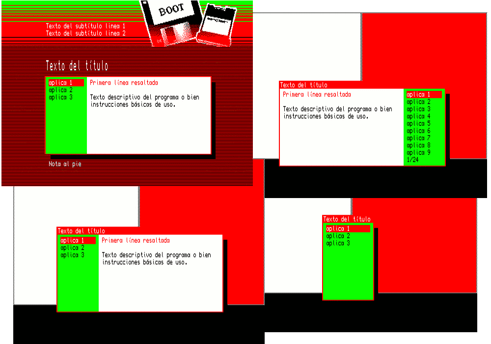

# Sinclair QL menu
JavGuerra multipurpose boot menu who run programs in the [Sinclair QL](https://en.wikipedia.org/wiki/Sinclair_QL "Sinclair QL info") easily.

## MENU BOOT

El programa, que está en su versión 1.4, fue creado y posteriormente actualizado en 2008.

Ofrece una variada gama de posibilidades de configuración para mostrar un menú desde el que seleccionar opciones, que puede usarse para arrancar desde distintos dispositivos de almacenamiento en el QL.

El menú puede mostrar o no información relacionada con las opciones según lo configuremos, puede recorrer una lista de opciones amplia, y lanzar una o varias de las opciones si se desea.

Se muestra a continuación un ejemplo de uso que corresponde al menú de inicio de un disco con varias aventuras conversacionales para QL.

## Instrucciones

Para obtener información y primeras indicaciones de uso, y mostrar el funcionamiento de 'MENU BOOT', ve a menu > menu_info, copia el contenido de la carpeta en tu QL y ejecuta:

LRUN menu_bas

o

LRUN boot

Si quieres cargar TK2.

Sigue las indicaciones que encontrarás en el manual:

* Versión en formato RTF: [manual.rtf](docs/manual.rtf "manual.rtf")
* Versión en formato TXT: [manual.txt](docs/manual.txt "manual.txt")

para realizar configuraciones en el menú.

Usa el contenido de menu > menu_demo para hacer tu propio menú.

__Importante__: Por defecto, el programa esta configurado para funcionar en 'flp1_'. Cambia el valor de la variable disp$ tanto en el boot como en menu_bas para indicar el dispositivo adecuado.

## Licencia

'MENU BOOT' está pensado para ser distribuido libremente con sus ficheros de configuración junto a los programas. No tiene pues restricciones de uso ni de modificación.

El autor agradecerá sea citado en los créditos.

## Contactar

Puedes contactar con el autor para consultas, modificaciones o propuestas de mejora.
También puedes contribuir a la mejora de esta aplicación a través de Github.

Visita: [SinclairQL.es](http://sinclairql.es "Sinclair QL Recursos en Castellano") para más información y recursos en castellano.
