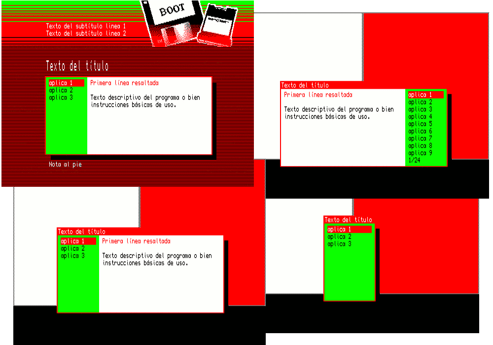
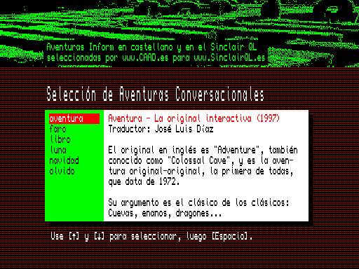

# Sinclair QL menu
JavGuerra multipurpose boot menu who run programs in the [Sinclair QL](https://en.wikipedia.org/wiki/Sinclair_QL "Sinclair QL info") easily.

##MENU BOOT

El programa, que está en su versión 1.4, fue creado y posteriormente actualizado en 2008.

Ofrece una variada gama de posibilidades de configuración para mostrar un menú desde el que seleccionar opciones, que puede usarse para arrancar desde distintos dispositivos de almacenamiento en el QL.

El menú puede mostrar o no información relacionada con las opciones según lo configuremos, puede recorrer una lista de opciones amplia, y lanzar una o varias de las opciones si se desea.

Se muestra a continuación un ejemplo de uso que corresponde al menú de inicio de un disco con varias aventuras conversacionales para QL.

## Instrucciones

Sigue las indicaciones que encontrarás en el manual:

* Versión en formato RTF: [menu.rtf](MENU_ES/MAN/manu.rtf "menu.rtf")
* Versión en formato TXT: [menu.txt](MENU_ES/MAN/manu.txt "menu.rtf")

Visita: [SinclairQL.es](http://sinclairql.es "Sinclair QL Recursos en Castellano") para más información y recursos castellano.